# On People Analytics

---

# 1.0 The context
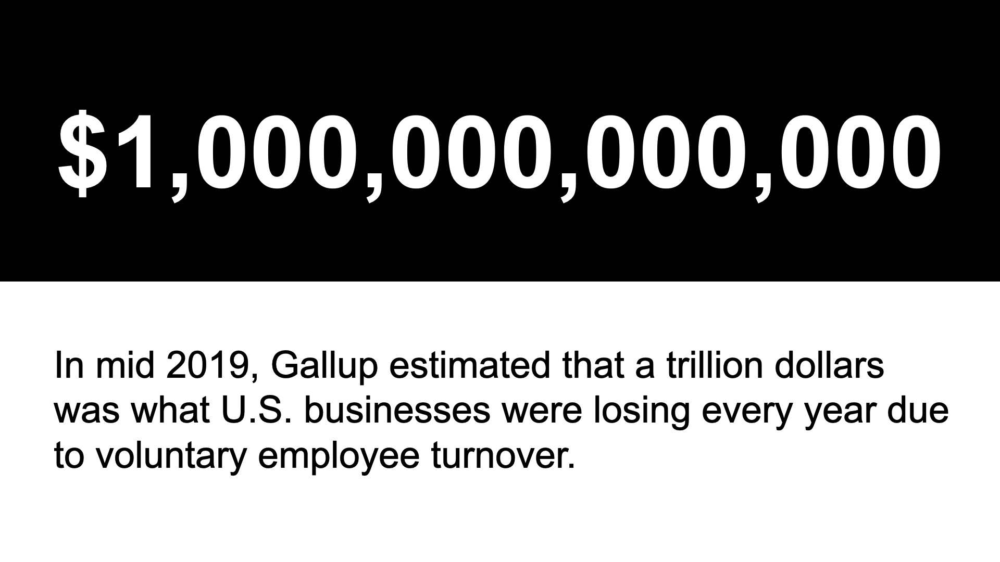

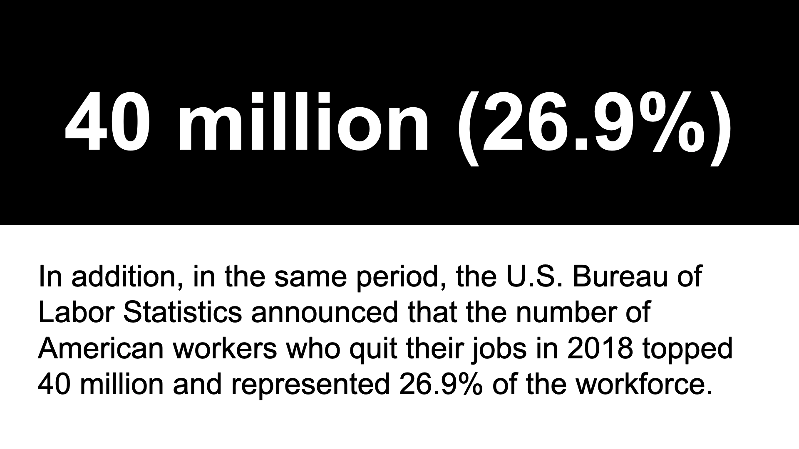

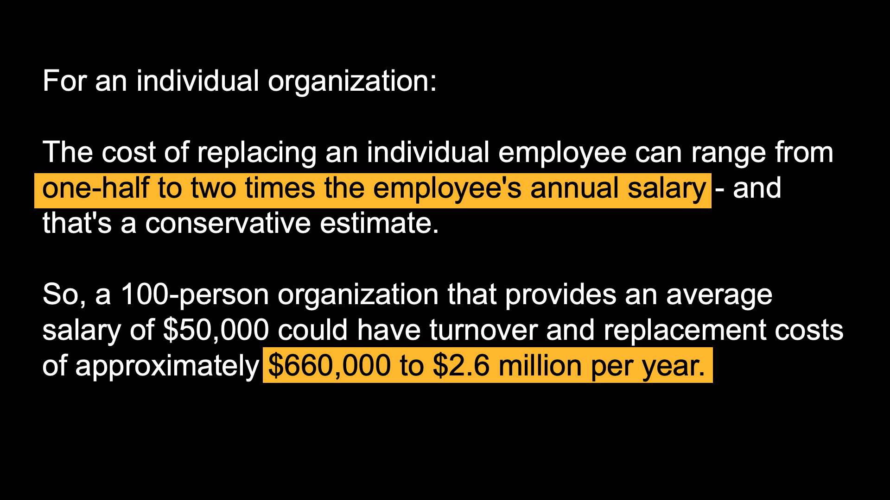

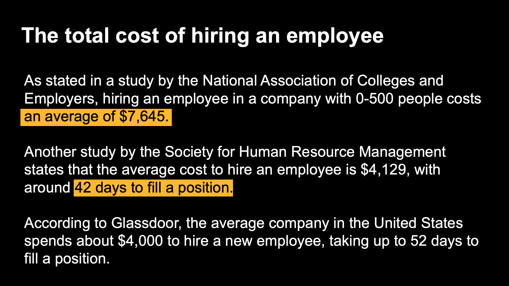

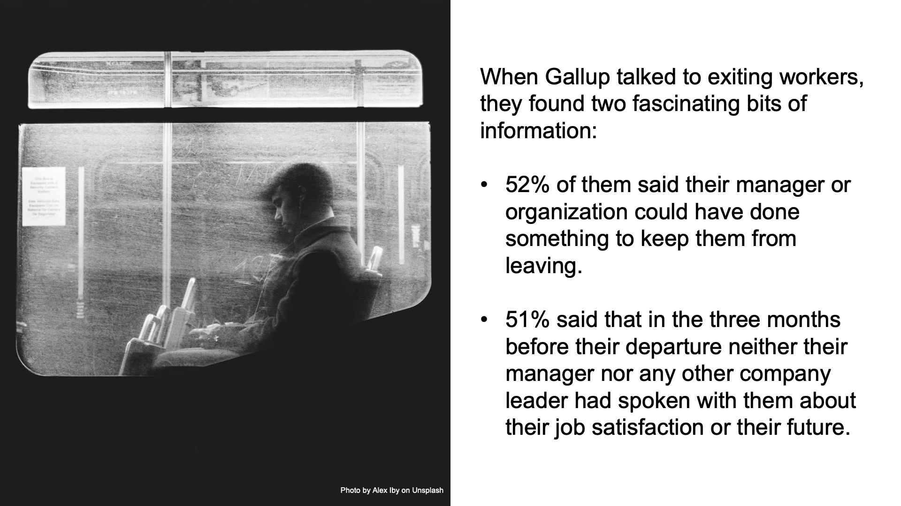

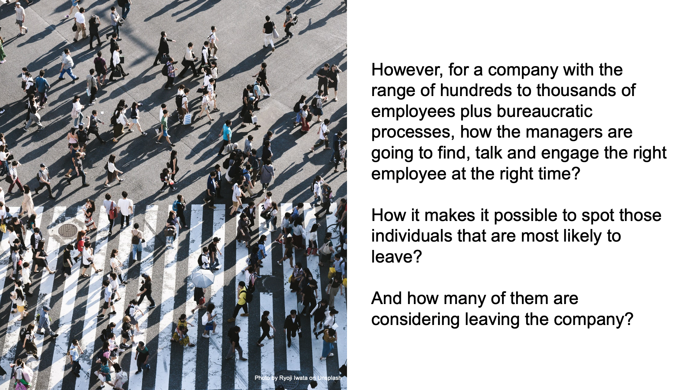

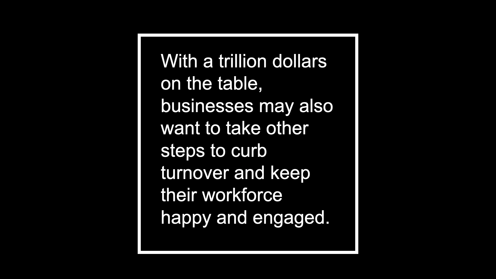

All the references are stated at the end of this README.

 

# 2.0 The problem
As mentioned, companies go through a lot of trouble when there is employee turnover. Although businesses know that this is a big problem that causes high losses, they don't really know how to tackle this problem. 

The C-Level might say: 

> *"We have all this data collected from all of our employees. We have their performance ratings, their Best Place To Work answers, etc. However, what do we do about it? How this data can help us prevent turnover? Who are the people that are most likely to leave? And what can we do to retain them? We can't afford to lose money anymore. "*

 

# 3.0 The solution
The designed solution is a web application that helps the HR team to have, among different information about the employees - who are most likely to leave the company, their identification numbers (`employee_number`).

The additional information range from department, education field, job satisfaction, job role, monthly rates to several others.

Once having this information, the team can download it and start acting on it.

Check it live at: https://people-analytics-bk.herokuapp.com/

**OBS: It may take a while to load the app, because I'm using the free tier of Heroku and in this tier app hibernate after 30 min of inactivity.**

### [July/2020] Solution Updates
Make sure to check the [part 2](https://medium.com/designed-by-data/on-people-analytics-employee-turnover-b493cec75f17) of this project as I **include Design Thinking applied to Employee Experience aided by Data Science**. I hope it is a very insightful source of information for companies that are concerned with their workforce.

 

## 3.1 What drove the solution

### 3.1.1 Exploratory Data Analysis
#### Descriptive Analysis

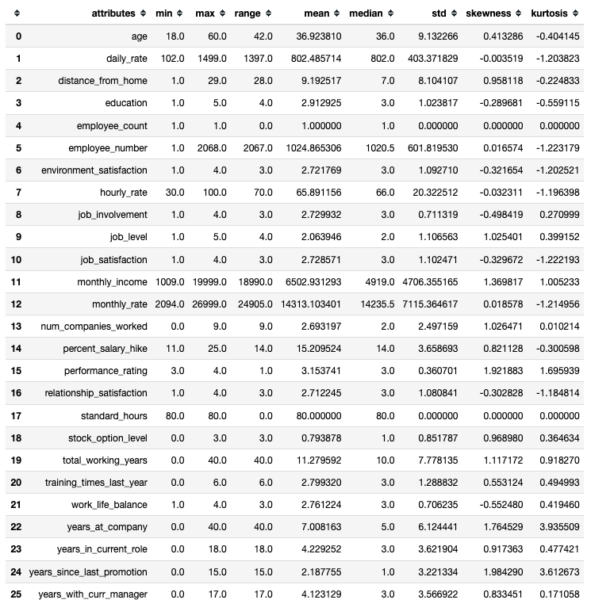

Key points:

- There are **all sorts of Ages** ranging from 18 to 60.
- The lowest **performance rating** is 3 and the highest is 4.
- There are **people that works really far from home**. The farthest people live 29 km from work.
- There are people that has been **working at the same company** for 40 years.

 

#### Hypothesis Map

This map to help us to decide which variables we need in order to validate the hypotheses.

#### Univariate Analysis

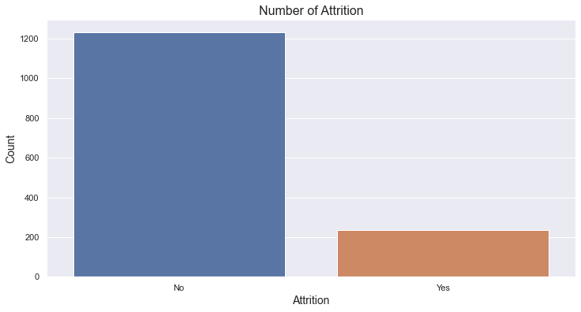

As observed, there are much more people that stayed than left the company.

 

### 3.1.2 Hypothesis validation - Bivariate Analysis
#### Main Hypothesis

#### H1. People up to 40s tend to leave.

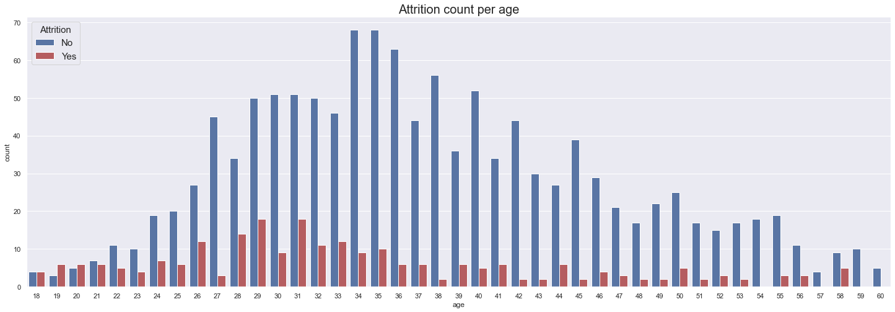

Although, up to 22 years old, comparing people who do tend to leave with who don't, the proportion of people who do tend to leave is large. In addition, it seems that people in young ages (up to 40s) tend to leave more than people in elder ages (40+). 

> Thus, the hypothesis is **TRUE**.

#### H3. People who live far from work tend to leave.

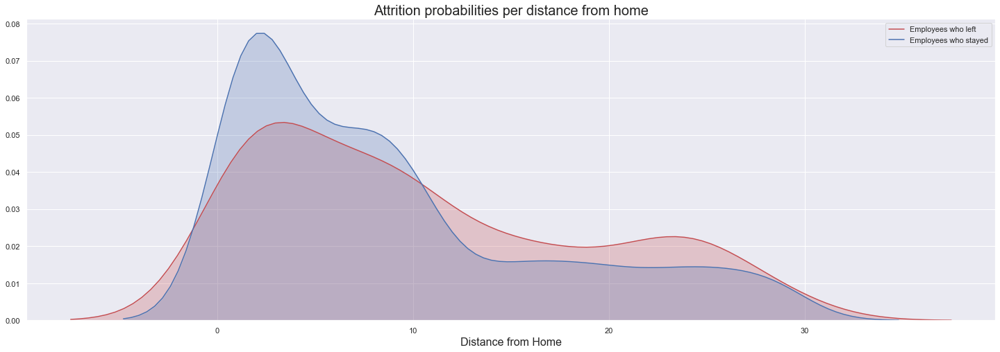

Observing the plots, as the distance gets higher, between 12 and 28, the tendency for an employee to leave is higher.

> Thus, the hypothesis is **TRUE**.

#### H11. People who feel less involved with the job tend to leave more.

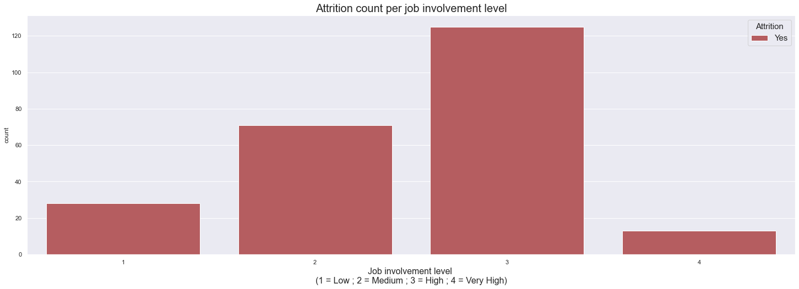

As observed, people who feel less involved with the job **don't tend to leave more**.

> Thus, the hypothesis is **FALSE**.

#### H14. People who have lower work life balance tend to leave more.

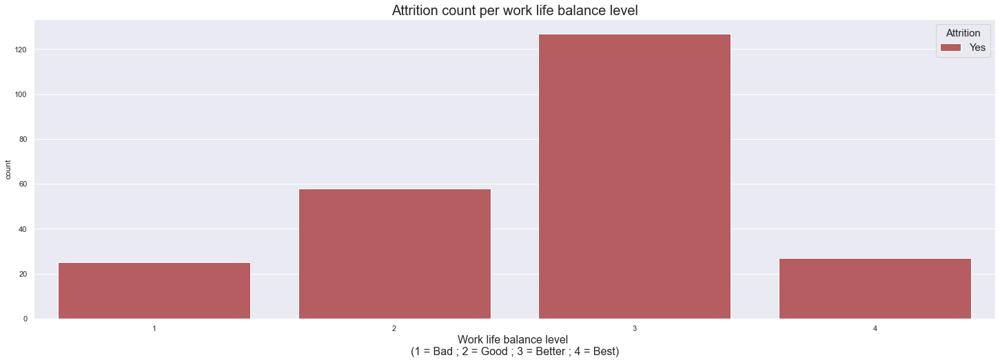

As observed, people who have lower work life balance **tend to leave less**.

> Thus, the hypothesis is **FALSE**.

#### H18. People who are making more money tend not to leave.

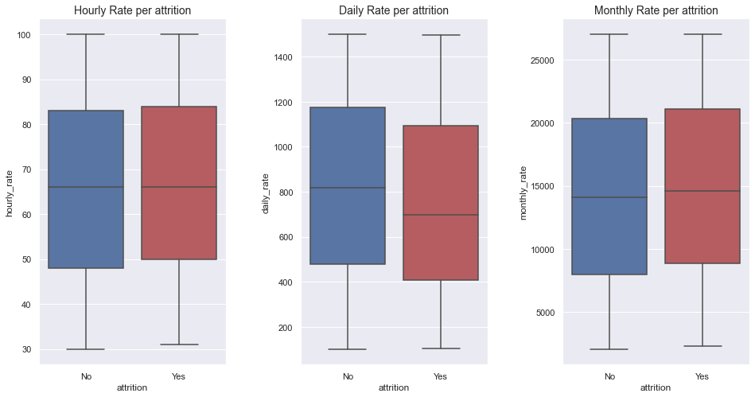

As observed, people who are daily making more money tend to stay. As the median for hourly rate and monthly rate are quite similar.

> Thus, the hypothesis is **TRUE**.

 

#### Hypothesis summary

Several other hypotheses were outlined and validated.

| ID  | Hypothesis                                                                           | Conclusion                                                                                                                                                                     |
|-----|--------------------------------------------------------------------------------------|--------------------------------------------------------------------------------------------------------------------------------------------------------------------------------|
| H1  | People up to 40s tend to leave                                                       | TRUE                                                                                                                                                                           |
| H2  | People that have higher degree of education tend to leave more                       | FALSE                                                                                                                                                                          |
| H3  | People who live far from work tend to leave                                          | TRUE                                                                                                                                                                           |
| H4  | Single people tend to leave more                                                     | TRUE                                                                                                                                                                           |
| H5  | People who make overtime tend to leave more                                          | TRUE                                                                                                                                                                           |
| H6  | People who present higher performance ratings tend to leave more                     | FALSE                                                                                                                                                                          |
| H7  | People who present lower performance ratings tend to leave more                      | FALSE                                                                                                                                                                          |
| H8  | People who have lower job level tend to leave more                                   | TRUE                                                                                                                                                                           |
| H9  | People who weren't promoted for long time tend to leave more                         | FALSE                                                                                                                                                                          |
| H10 | People who are in the current role for long time tend to leave more                  | FALSE                                                                                                                                                                          |
| H11 | People who feel less involved with the job tend to leave more                        | FALSE                                                                                                                                                                          |
| H12 | People who feel less satisfied with the job tend to leave more                       | FALSE                                                                                                                                                                          |
| H13 | People who feel less satisfied with the environment tend to leave more               | As observed, we can't really say if people who feel less satisfied with the environment tend to leave more, because the counts are almost equal for each level of satisfaction |
| H14 | People who have lower work life balance tend to leave more                           | FALSE                                                                                                                                                                          |
| H15 | People who professionally worked for more years tend to not leave                    | TRUE                                                                                                                                                                           |
| H16 | People who worked at the same company for more years tend not to leave               | TRUE                                                                                                                                                                           |
| H17 | People who are job hoppers tend to leave more                                        | FALSE                                                                                                                                                                          |
| H18 | People who are making more money tend not to leave                                   | TRUE                                                                                                                                                                           |
| H19 | People who have shorter salary hike range tend to leave                              | TRUE                                                                                                                                                                           |
| H20 | People who received less training last year tend to leave more                       | People who received few and many training sessions last year tend to stay\. However, people who are in the middle tend to leave                                                |
| H21 | People who have been working for the same manager for short years tend to leave more | TRUE                                                                                                                                                                           |
| H22 | People who have lower quality of relationship with the manager tend to leave more    | FALSE                                                                                                                                                                          |
| H23 | People who travel more frequently tend to leave more                                 | FALSE                                                                                                                                                                          |
| H24 | Which departments has more turnover?                                                 | As observed, Research & Development has more turnovers than other departments                                                                                                  |
| H25 | Which education field has more turnover?                                             | As observed, Life Sciences is the education field which has more turnover, followed by Medical and Marketing                                                                   |

 

### 3.1.3 Machine Learning

Tests were made using different algorithms.

#### Performance Metrics 

#### Confusion Matrix
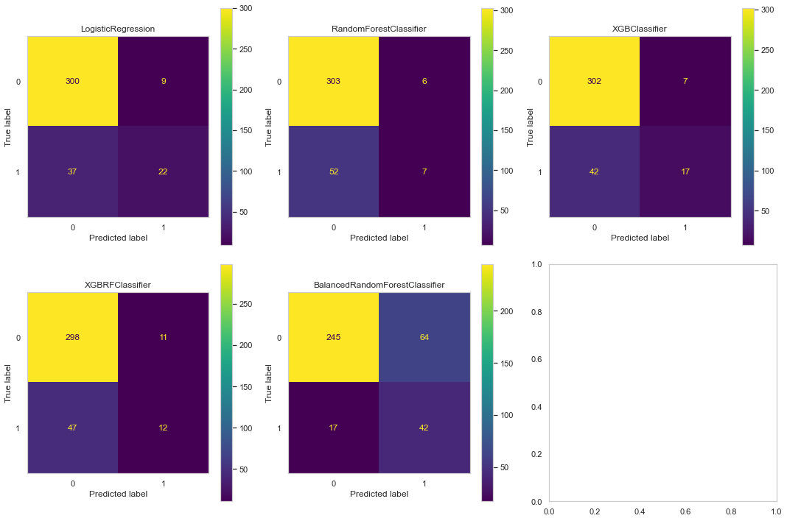

 

#### 3.1.3.1 Conclusion

As observed and according to our business metrics, we're trying to minimize the FN and maximize the TP. Thus, the algorithm that best suits our needs is the **`LogisticRegression`**. Although, it has the highest FP, for our case, it's not a bad idea to check on these employees, as we can discover new things about them and motivate them.

 

### 3.1.4 Business Performance

As mentioned early, when an employee leaves the company, the position will have to be replaced which leads to a high cost and energy consuming hiring process (head hunting, CV review, interviews, tests, onboarding, etc.)

So, when building a machine learning model we are going to focus on optimizing its performance metrics, that is, **minimizing the False Negatives while maximizing the True Positives**.

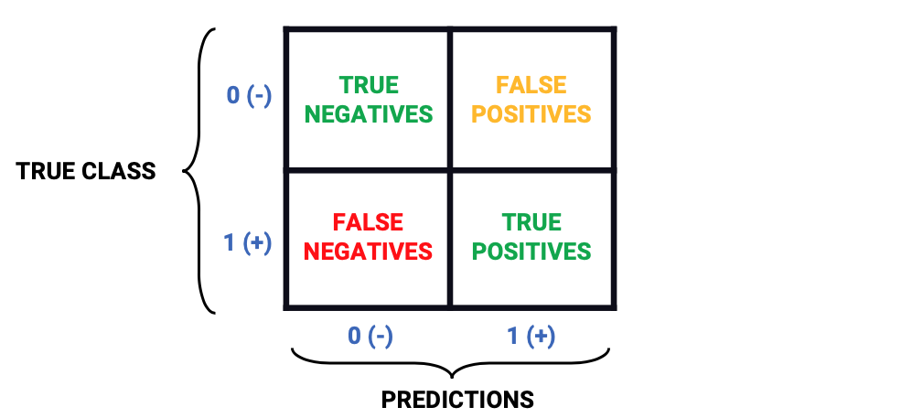

In addition, we can outline a **best-worst scenario** for an employee who leaves a company.

|                                  | Best scenario | Worst scenario |
|----------------------------------|---------------|----------------|
| **Cost \($\)**                   | 4,000         | 7,645          |
| **Time to fill a position \(days\)** | 42        | 52             |

Testing the model using a data set containing 294 records, it was able to correctly identify 34 (True Positives) and miss 13 (the False Negatives) from a total of 47 employees who tend to leave. Translating to the best-worst scenario, this means:

|                                  | Best scenario | Worst scenario |
|----------------------------------|---------------|----------------|
| **Total loss prevented \($\)**   | 136,000       | 259,930        |
| **Total time saved \(days\)**    | 1,428         | 1,768          |

In addition, **without the model**, the company would have 47 employees that could leave, translating it to **a total loss of \$ 188,000 in the best scenario and \$ 359,315 in the worst scenario**.

 

### 3.1.5 Machine Learning Performance for the chosen algorithm

The chosen algorithm was the **Logistic Regression**.

#### Precision and Recall, AUC, Confusion Matrix and other metrics

| precision | recall    | f1\-score | roc auc   | accuracy  |
|-----------|-----------|-----------|-----------|-----------|
| 0\.32381  | 0\.723404 | 0\.447368 | 0\.777156 | 0\.714286 |

 

|              | precision | recall | f1\-score | support |
|-------------:|----------:|-------:|----------:|--------:|
| 0            | 0\.93     | 0\.71  | 0\.81     | 247     |
| 1            | 0\.32     | 0\.72  | 0\.45     | 47      |
| accuracy     |           |        | 0\.71     | 294     |
| macro avg    | 0\.63     | 0\.72  | 0\.63     | 294     |
| weighted avg | 0\.83     | 0\.71  | 0\.75     | 294     |

 

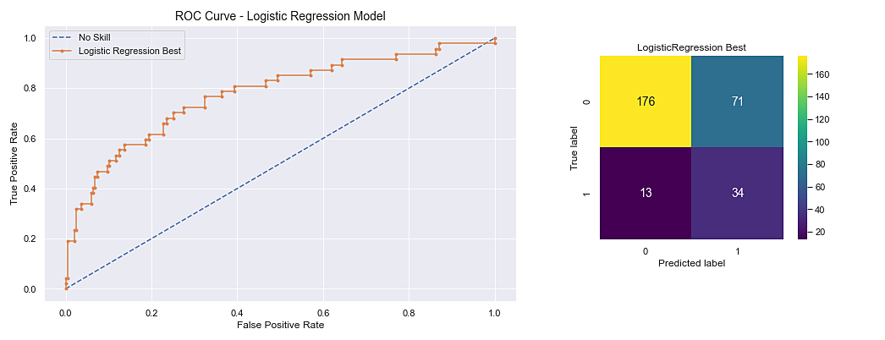

 

#### Probability Distribution

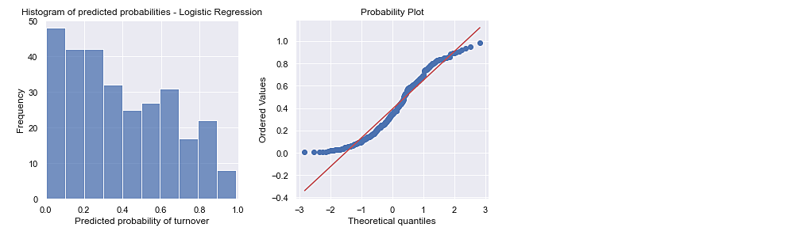

Looking at the `Probability Plot` for `LogisticRegression` the points are well distributed, it forms a smooth S-shaped curve and the red diagonal seems to form a 45 angle with the X-axis. Thus, this just reinforces our previous decision on choosing the `LogisticRegression` as the classifier for the project.

 

# 4.0 Next Steps

**4.1 Build an analytics dashboard** in a data visualization tool (e.g. Tableau, Power BI) so the HR team can have a clear view about the characteristics of employees that are most likely to leave the company.

**4.2 Recommend decisions** to the HR team based on groups of employees so it can make the right initiatives to prevent turnover.

**4.3 Test other techniques** to train the model, including artificial neural networks (e.g. TensorFlow, PyTorch).

**4.4 Include Design Thinking applied to Employee Experience aided by Data Science**, because only identifying the employees is not enough if companies don't know how to approach them. Actually, this can be the **part two of this project** which I described in [**this Medium post**](https://medium.com/@brunokatekawa/on-people-analytics-employee-turnover-b493cec75f17).

 

# References

https://business.linkedin.com/talent-solutions/blog/employee-retention/2019/gallup-suggests-employee-turnover-in-us-business-is-1-trillion-dollar-problem-with-simple-fix

https://www.gallup.com/workplace/247391/fixable-problem-costs-businesses-trillion.aspx

https://www.gallup.com/workplace/260564/heard-quit-rate-win-war-talent.aspx

https://toggl.com/blog/cost-of-hiring-an-employee
